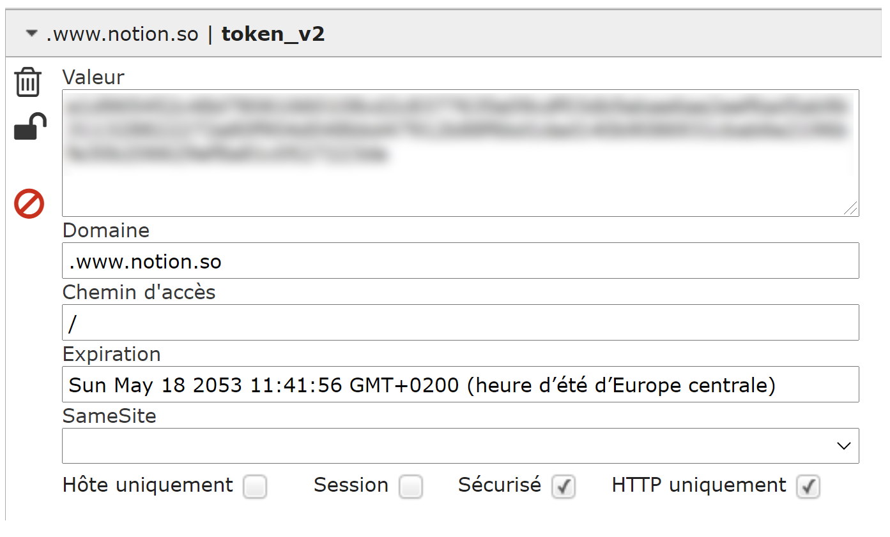
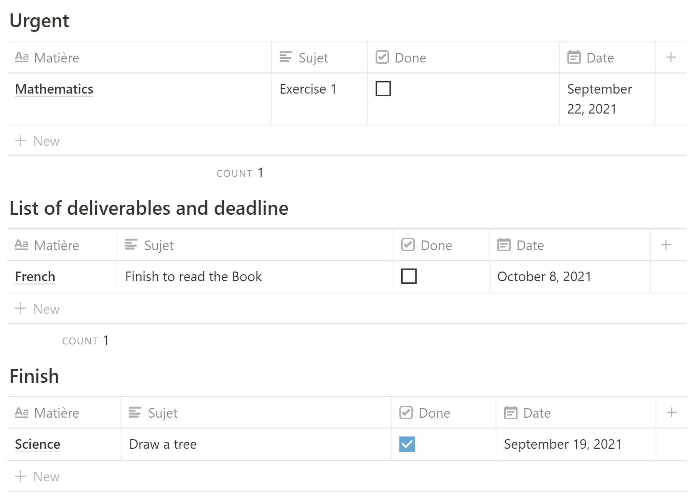
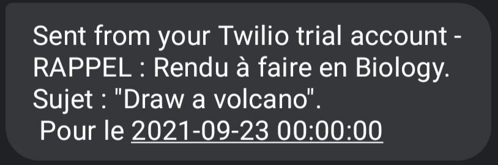

# Task Manager With SMS Reminder For Notion

I present you a small python script allowing to automate some tasks on Notion.

Main goal : to allow you to sort your tasks and school reports. To do so, you just have to create tasks in a Notion table by indicating a due date. At two days from the due date, the task will automatically move to another table named "Urgent" and you will receive an SMS indicating that you have a due date. 

(I'm not using the official API, I'm using https://github.com/jamalex/notion-py)

# Usage

The way it works is quite simple: you only need to create 3 tables on your Notion page. The first one will be the one where you enter the tasks you have to do, the second one will contain all the urgent tasks and the third one will be for the finished tasks (when you check a task, the script considers that you have finished it and moves it)

In the best case, use a VPS and create a cron job that will automatically launch this script every 6 hours

# Requirements

Twilio : ```pip3 install twilio```

Notion : ```pip3 install git+https://github.com/jamalex/notion-py.git@refs/pull/294/merge```

# The variables to be modified

### These informations allow the script to send reminder SMS (i'm using https://www.twilio.com/fr/)

##### • account_sid = "TWILIO ACCOUT SID"
##### • auth_token = "TWILIO AUTH TOKEN"
##### • myPhoneNumber = "YOUR PHONE NUMBER (+33x xx xx xx xx for France)"
##### • twilioPhoneNumber = "TWILIO PHONE NUMBER"


### To obtain these tokens, just open your database as a page and copy the URL.

##### • cvListeTotale = client.get_collection_view("LINK TO MAIN DATABASE WITH ALL TASK TO DO")
##### • cvListeUrgente = client.get_collection_view("LINK TO URGENT DATABASE")
##### • cvListeFinies = client.get_collection_view("LINK TO THE DATABASE WITH ALL DONE TASK")

### To obtain the token_v2, you can use an extension that allows you to see your cookies on your browser. You just have to copy the cookie token_v2 :



#### token_v2="[YOUR TOKEN V2 (FROM COOKIES)]"

# On Notion 

You just have to create 3 identical tables and add your tasks to the main table



# SMS


